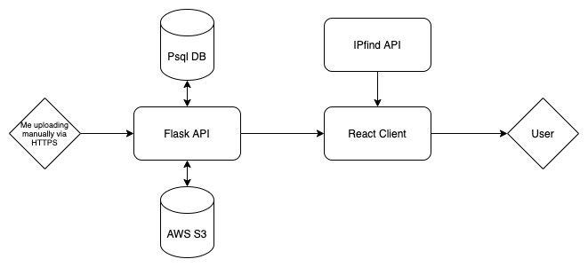

# metuo

**Photography portfolio site**

Features:

* Shows pictures taken nearest to you first
* No adverts
* Simple design
* Relevant filtering
* URL parameter sharing

## MVP Design




## Development set up

**Requires local installation of [docker-compose](https://docs.docker.com/compose/install/) and [node/npm.](https://www.npmjs.com/get-npm)** 

The Makefile contains common workflow commands and is only used for local development.

### Server installation and start up

From the project root folder, first run the **installation command**:

```bash
make install
```

While the docker container is running, in another shell run the **database creation command**:

```bash
make database
```

This will create the required docker images and run their containers for the `api server` and the `postgres database`. 

To simply start this environment in the future run the **start command**:

```bash
make start
```

**The server should be accessible at `http://0.0.0.0:5000/`**

### Client installation and start up

Navigate to the `client` directory, and **install the node modules**:

```bash
cd client
npm ci
```

Once the node modules have been installed, **start the client development server**:

```bash
npm run start
```

**The client should be accessible at `http://0.0.0.0:3000/`**

## Common workflows

### Environment introspection

The `Makefile` provides quick and easy access to the server and database:

* `make servershell` creates an interactive terminal in the running api docker container
* `make psqlshell` creates a connection to the api database

### Rebuilding the api server

To rebuild and restart the flask api server **run the restart command**:

```bash
make restart
```

### Recreating the database

To recreate the database, **first remove the `postgres-data` directory and it's contents**:

```bash
rm -rf postgres-data
```

Then run the **run the restart command**:

```bash
make restart
```

Finally, while the docker container is running, in another shell run the **database creation command**:

```bash
make database
```

### Testing AWS S3 image uploading

To save images to S3 from the development environment rather than locally, **change the following environment variables in the `.env` file**:

* `IMAGE_DIRECTORY` - Change this to the bucket name
* `AWS_ACCESS_KEY_ID` - Update this with a key ID that is authorised to interact with the bucket
* `AWS_SECRET_ACCESS_KEY` - Update this with a key secret that is authorised to interact with the bucket
* `FLASK_DEBUG` - Change this to `0` (alternatively, change all references in the code to expect this to be `1` to keep development debug messages and behaviours, **but do not commit this change**)

Then **restart the server docker container**:

```bash
make restart
```
